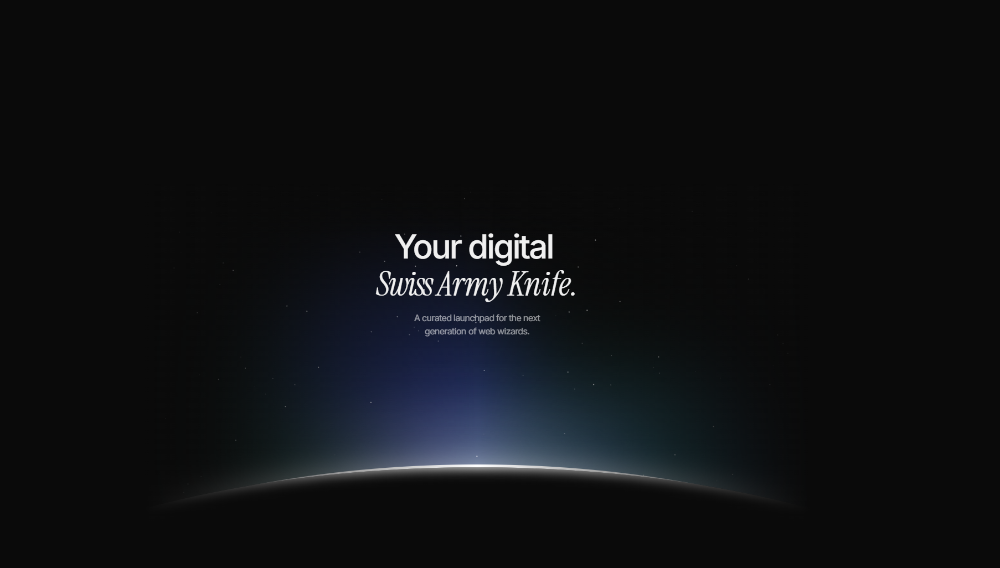

# Gitgud: Your Digital Swiss Army Knife for Development 🛠️

**"The developer's guide to actually getting good."**

---

**[Live Website](https://your-framer-site-link.com) | [Framer Link](https://framer.com/projects/Waitlister-copy--nEEqvGw79rUKsmROGNu0-aDPW7)**

## The Genesis: Slaying the Dragon of Information Overload 🐉

Every developer, from the greenest rookie to the seasoned veteran, knows the struggle. The internet is a vast ocean of tutorials, tools, and documentation, but navigating it feels like drinking from a firehose 🚒. Finding high-quality, relevant resources is a full-time job, and the frustration can be a major barrier to progress.

**Gitgud** was born from a simple desire: to create the resource hub I wish I had when I started. A place that isn't just a boring list of links, but a curated, opinionated, and genuinely helpful launchpad. A place that respects your time and helps you get straight to the good stuff.

## The Creative Process: From Abstract Idea to Interactive Reality 💡

The journey to build Gitgud was a two-act play, combining meticulous design with ambitious technical learning.

### Act I: Coding the Core, Assisted by Design Super-Tools

It all started in **Figma** 🎨, where the initial vision was sketched out. The goal was a design that was clean, intuitive, and visually engaging—the antithesis of cluttered, ad-ridden resource sites. Wireframes and mockups focused on a clear hierarchy, easy navigation, and a touch of personality.

With a solid blueprint, the real coding began. The site was built from the ground up, but I leveraged the power of **Framer** 🚀 to tackle the more complex parts. It acted as a visual playground to prototype and perfect intricate animations and interactive components. This allowed me to translate visual ideas into clean, production-ready code, saving countless hours of manual CSS tweaking and ensuring a polished user experience that feels alive and responsive.

### Act II: The n8n Quest for an AI Brain 🤖

A static site wasn't enough. To truly be a "guide," Gitgud needed a brain. I wanted a conversational assistant that could provide personalized help, making the site feel less like a library and more like a mentor.

This led me down the rabbit hole of automation and integration, where I discovered **n8n**. With zero prior experience, I dove into learning n8n from scratch, driven by the goal of building a custom AI chatbot for this specific project.

The process involved:
1.  **Learning the Ropes:** Understanding n8n's node-based logic, workflows, and core concepts.
2.  **Setting up a Webhook:** Creating an endpoint to listen for messages from the website's frontend.
3.  **Integrating an LLM:** Connecting the workflow to an AI model (like OpenAI's GPT) to process natural language and generate intelligent, context-aware responses.
4.  **Building the Logic:** Crafting a workflow that could handle different user queries, provide resource suggestions, and maintain the "Gitgud" personality.
5.  **The Final Integration:** Connecting the Framer-assisted frontend to the n8n backend. This was achieved by creating a custom React component that sends user messages to the n8n webhook and displays the AI's response in real-time.

This self-taught journey into n8n was a challenging but incredibly rewarding part of the project, resulting in a truly unique and powerful feature.

## User Impact: Your Companion in the Code Trenches 🧑‍💻

Gitgud is engineered to be more than just a utility. It's a companion for your development journey.

* **For the Beginner:** It provides a clear, curated path, cutting through the noise and presenting the best-in-class resources for learning foundational skills. The AI chatbot is there to answer questions and provide encouragement when you get stuck.
* **For the Intermediate Developer:** It's the digital Swiss army knife you can rely on. Need a specific tool? Looking for inspiration for your next project? Gitgud has a hand-picked selection ready to go, saving you hours of searching.
* **For All Developers:** It's a source of motivation. The fun, slightly sarcastic tone is a deliberate choice to combat the sterile, often intimidating nature of technical content. It’s a reminder that coding can and should be fun.

By providing fun, high-quality resources in an accessible format, Gitgud empowers users to learn more effectively, build better projects, and ultimately, "git gud" at their craft.

## Tech Stack 🛠️

* **Design & Prototyping:** Figma
* **Website & Frontend:** React, HTML/CSS (with Framer for component prototyping)
* **Chatbot Backend & Automation:** n8n
* **AI & Language Processing:** OpenAI (or your chosen LLM provider)
* **Custom Integration:** Fetch API

## Future Roadmap 🗺️

Gitgud is a living project. Future plans include:
* [ ] User accounts to save favorite resources.
* [ ] Community-submitted links and tools.
* [ ] More advanced chatbot capabilities, including memory and context from previous conversations.

---

*This project was a labor of love and learning. Feel free to reach out with feedback or suggestions!*
